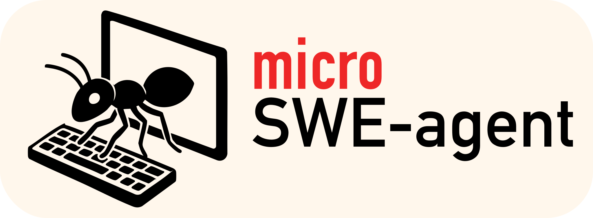

<h1>The 100 line AI agent that's actually useful</h1>

- **🐜 Minimal**: Just [100 lines of python](https://github.com/SWE-agent/micro-swe-agent/blob/main/microsweagent/agents/default.py) (+100 for [env](https://github.com/SWE-agent/micro-swe-agent/blob/main/microsweagent/environments/local.py), [model](https://github.com/SWE-agent/micro-swe-agent/blob/main/microsweagent/models/litellm_model.py), [script](https://github.com/SWE-agent/micro-swe-agent/blob/main/microsweagent/run/hello_world.py)) — no fancy dependencies! Optionally, a few more lines for interactive UIs.
- **💪 Powerful:** Resolves issues on the [SWE-bench verified benchmark](https://www.swebench.com/).
- **🤗 Friendly:** Comes with **two convenient UIs** that will turn this into your daily dev swiss army knife!
- **🎓 Cutting edge:** Built by the Princeton & Stanford team behind [SWE-bench](https://swe-bench.com) and [SWE-agent](https://swe-agent.com).

**Use it to:**

- 🔥 Instantly solve problems: `pip install pipx && pipx run micro-swe-agent`
- ⚙️ Take full control & quickly build custom agents
- 🏋 Fine-tune & RL with a minimal, assumption-free agent
- 🐳 Deploy seamlessly to sandboxed environments & CI/CD

??? info "Why use micro-SWE-agent for research?"

    [SWE-agent](https://swe-agent.com/latest/) jump-started the development of AI agents in 2024. Back then, we placed a lot of emphasis on tools and special interfaces for the agent. However, one year later, a lot of this is not needed at all to build a useful agent!

    In fact, micro-SWE-agent:

    - **Does not have any tools other than bash** — it doesn't even use the tool-calling interface of the LMs. This means that you can run it with literally any model. When running in sandboxed environments you also don't need to take care of installing a single package — all it needs is bash.
    - **Has a completely linear history** — every step of the agent just appends to the messages and that's it. So there's no difference between the trajectory and the messages that you pass on to the LM.
    - **Executes actions with `subprocess.run`** — every action is completely independent (as opposed to keeping a stateful shell session running). This makes it trivial to execute the actions in sandboxes (literally just switch out `subprocess.run` with `docker exec`) and to scale up effortlessly.

    This makes it perfect as a baseline system and for a system that puts the language model (rather than the agent scaffold) in the middle of our attention.

??? info "Why use micro-SWE-agent as a tool?"

    Some agents are overfitted research artifacts. Others are UI-heavy tools, highly optimized for a specific user experience. Both variants are hard to understand.

    `micro` wants to be:

    - **Simple** enough to understand at a glance
    - **Convenient** enough to use in daily workflows
    - **Flexible** to extend

    A hackable tool, not a black box.

    Unlike other agents (including our own [swe-agent](https://swe-agent.com/latest/)), it is radically simpler, because it:

    - Does not have any tools other than bash — it doesn't even use the tool-calling interface of the LMs.
    - Has a completely linear history — every step of the agent just appends to the messages and that's it.
    - Executes actions with `subprocess.run` — every action is completely independent (as opposed to keeping a stateful shell session running).

micro-SWE-agent comes with two convenient interfaces:

<b>Simple UI</b>

<b>Textual UI</b>

## Get Started

Ready to try micro-SWE-agent?

**[🚀 Installation & Quick Start →](installation.md)**

Install with pipx in seconds or set up for development - choose your path and get started immediately!

## What's Next?

Ready to dive deeper? Check out:

- **[🚀 Installation & Quick Start](installation.md)** - Get up and running in minutes
- **[API Reference](reference/index.md)** - Explore all available components
- **[Run Scripts](reference/run/hello_world.md)** - Learn how to create custom entry points
- **[Models](reference/models/litellm.md)** - Configure different language models
- **[Environments](reference/environments/local.md)** - Set up different execution environments

## Contributing

We happily accept contributions! Areas where we'd love help:

- Support for more models (anything where `litellm` doesn't work out of the box)
- Documentation, examples, tutorials, etc.
- Support for more environments & deployments (e.g., run it as a github action, etc.)
- Take a look at the [issues](https://github.com/SWE-agent/micro-SWE-agent/issues) and see if there's anything you'd like to work on!
